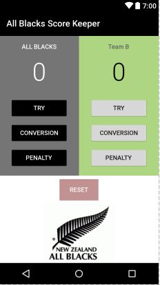

This project is part of the Udacity course ud836 [Android Basics : User Input](https://www.udacity.com/course/android-basics-user-input--ud836), Lesson 4.

I am not sharing the whole project here, just the files that have been modified:
* activity_main.xml
* MainActivity.java
* styles.xml  (for changing the colour of the status bar and the action bar)
* AndroidManifest.xml   (for changing the name of the app -label- and disabling Landscape mode -screenOrientation-)

  
